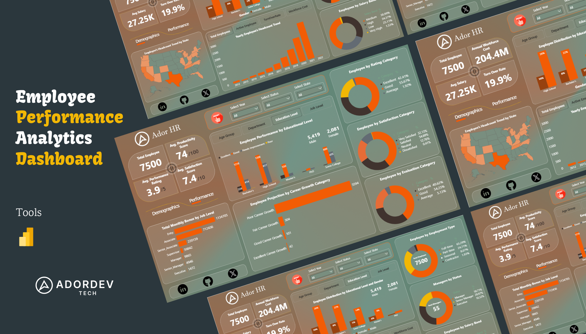
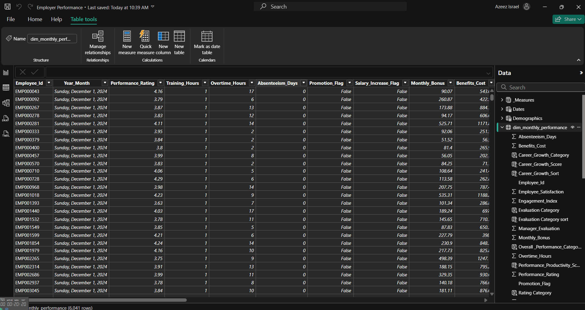
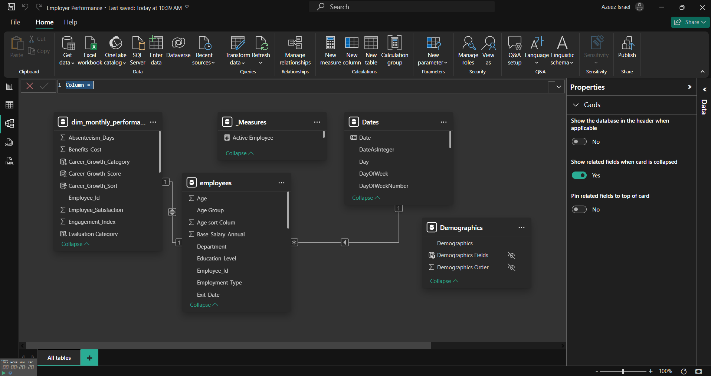
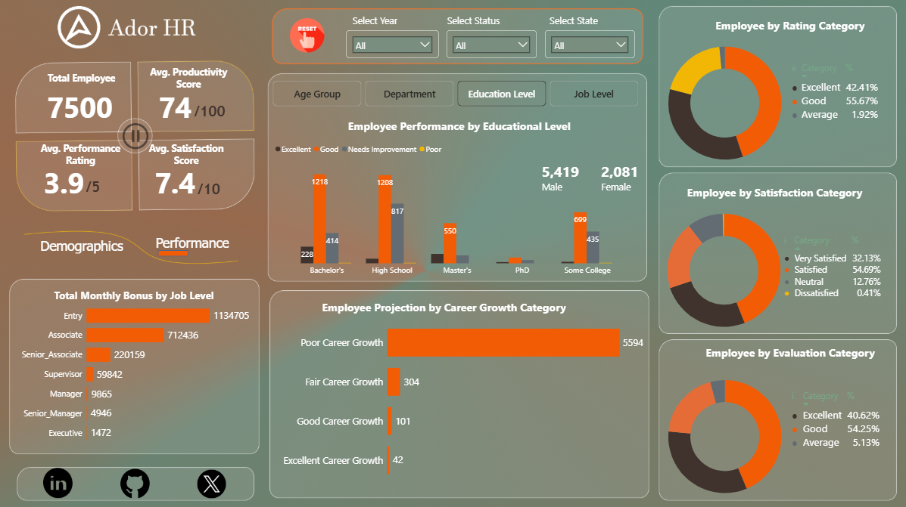

# 🧠 Employee Performance Analytics  
**Comprehensive Workforce Performance Analysis Using Power BI**

---

## 📌 1. Title  
**Employee Performance Analytics Dashboard**

---

## 🧭 2. Introduction  
This project provides an end-to-end analysis of employee performance data for a large organization.  
The goal is to help HR teams and leadership **understand workforce dynamics**, **improve employee satisfaction**, and **enhance overall organizational effectiveness**.

It simulates a professional HR Management System with more than **497,000 employee performance records**, combining HR, financial, and operational metrics.

---

## 🧾 3. About the Data  
The dataset contains detailed HR and performance information across multiple dimensions:

- 👤 **Employee Demographics** – Age, gender, education, job level, department, and employment type  
- 📊 **Performance Metrics** – Productivity scores, ratings, satisfaction, training hours, and KPIs  
- 💰 **Compensation Data** – Salary, bonuses, workforce cost, and benefits  
- 🧩 **Manager & Team Structure** – Manager evaluation, promotion flags, and team growth  
- 🕒 **Monthly Tracking** – Performance and satisfaction data across several months and years  
- 🏢 **Store & Regional Data** – Location, department, and sales outcomes  

---

## ⚙️ 4. Methodology  

### 🧮 Data Collection  
Data was extracted from the HRMS database and provided in a structured table format resembling enterprise workforce records.  

---

### 🧹 Data Cleaning & Transformation  
Performed in **Power Query (M Language)** and **DAX**, including:  
- Removing duplicates and null records  
- Standardizing date/time and department names  
- Creating calculated columns (e.g., *Performance Category*, *Evaluation Category*, *Turnover Rate*)  
- Handling missing data using conditional logic  
- Building relationships between fact and dimension tables  

---

### 🔍 Exploratory Data Analysis  
Explored key distributions and statistical relationships such as:  
- Salary vs Job Level  
- Training Hours vs Performance Score  
- Department vs Turnover Rate  
- Satisfaction Score vs Performance Rating  

---

### 📊 Visualization  
Developed using **Power BI Desktop**, integrating slicers and KPI visuals:  
- Cards, pie charts, bar charts, maps, and trend visuals  
- Interactive filters for year, state, and employee status  
- DAX-based performance measures and custom sorting  

---

### 📈 Statistical Analysis  
Applied statistical logic and DAX expressions for:  
- Performance Category classification  
- Evaluation Category sorting  
- Turnover and salary ratio calculations  
- Productivity correlation analyses  

---

### 🧠 Interpretation & Recommendations  
Insights were interpreted in business context to guide HR decision-making and identify improvement areas.

---

## 🧩 5. Data Structure Image  
*(Insert a schema or table preview image here)*  

---

## 🗺️ 6. Data Model Overview  
A star schema model was designed in Power BI:

**Fact Table:** `fact_employee_performance`  
**Dimension Tables:** `dim_employee`, `dim_department`, `dim_manager`, `dim_date`, `dim_location`

Relationships:

---

## 📈 7. Analysis  
Key analytical questions addressed:

1. **How many employees left the company?**  
   → HR Attrition Report identified departments with the highest turnover.  

2. **Average salary by job level and department**  
   → Higher salaries concentrated at executive and specialized technical roles.  

3. **Months with highest employee performance ratings**  
   → Peaks in Q4 linked to annual review incentives.  

4. **Top 10 managers by team performance**  
   → Ranked based on average subordinate productivity scores.  

5. **Training hours vs performance relationship**  
   → Positive correlation observed up to 40 training hours.  

6. **Top 5 stores by sales**  
   → Found stronger alignment with staff satisfaction and manager quality.  

7. **Satisfaction by department**  
   → Customer-facing departments had higher satisfaction levels.  

8. **Productivity by job role**  
   → Executive and managerial roles had highest productivity indices.  

9. **Promotion likelihood**  
   → High satisfaction + high performance correlated strongly with promotions.  

10. **Age vs performance**  
   → Mid-career employees (30–45) showed consistently higher ratings.

---

## 📊 8. Dashboards  

### 🧍‍♂️ Demographics Dashboard  

**Key Metrics**
- Total Employees: **7,500**  
- Annual Workforce Cost: **$204.4M**  
- Average Salary: **$27.25K**  
- Turnover Rate: **19.9%**  

**Highlights**
- Employee distribution by education level, gender, and job level  
- Geographic distribution of workforce  
- Employment type segmentation  

---

### 📈 Performance Dashboard  

**Key Metrics**
- Avg. Productivity Score: **74/100**  
- Avg. Performance Rating: **3.9/5**  
- Avg. Satisfaction Score: **7.4/10**

**Highlights**
- Performance by education level  
- Career growth category projection  
- Employee rating, satisfaction, and evaluation category segmentation  

---

## 💡 9. Key Insights  
- Employees with **higher education** and **consistent training** perform better overall.  
- **Career stagnation** is a major factor in dissatisfaction and turnover.  
- **Manager quality** directly correlates with team performance.  
- **Bonuses and incentives** significantly improve productivity and retention.  
- **Fair compensation structures** across departments drive engagement.  

---

## 🧭 10. Recommendations  

1. **Enhance Career Growth Programs**  
   - Prioritize internal mobility and promotion pathways.  

2. **Improve Manager Training**  
   - Equip managers with coaching and feedback tools to boost team output.  

3. **Optimize Compensation Packages**  
   - Adjust pay scales by role and performance metrics.  

4. **Expand Training Initiatives**  
   - Link training completion to performance bonuses.  

5. **Monitor Satisfaction Regularly**  
   - Use dashboards for monthly pulse checks and trend alerts.  

6. **Automate KPI Tracking**  
   - Maintain Power BI dashboards for real-time workforce analytics.

---

## 🧰 Tools & Technologies  
- **Power BI Desktop**  
- **DAX & Power Query (M Language)**  
- **Microsoft Excel**  
- **SQL Server**  
- **GitHub for documentation & version control**

---

## 🏁 Conclusion  
This Power BI analytics project transforms raw HR data into actionable workforce insights.  
It empowers HR leaders to make data-driven decisions, monitor key performance indicators, and improve employee engagement and retention.

[Click it out on Power BI](https://app.powerbi.com/view?r=eyJrIjoiYjllNWE0MDgtNTk3YS00MDViLTk3NzQtODJjYjUzZGYxYTA4IiwidCI6IjhmNzg3ODg0LTA2MTctNDEzMi05MzFhLTQyYjljM2ViNjM3YiJ9)
